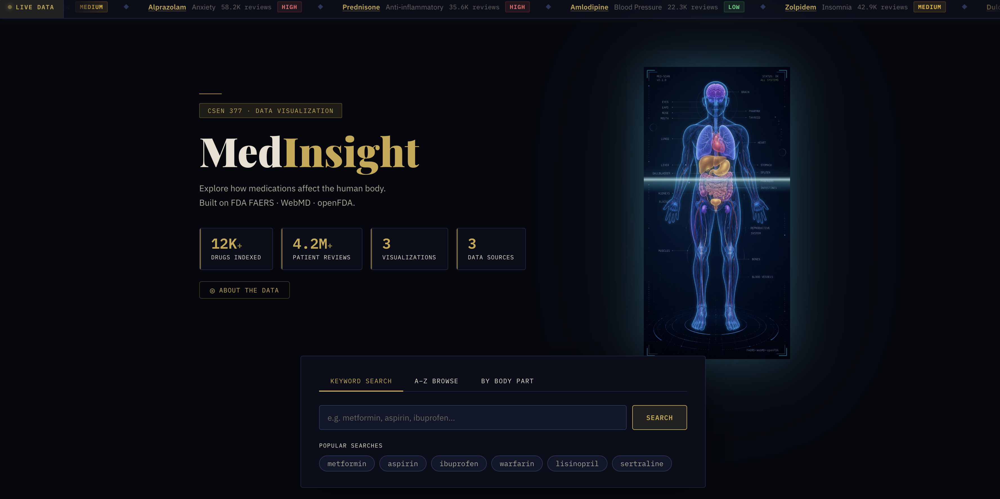

# MedInsight

Drug Visualization Platform | CSEN 377 Data Visualization, SCU Spring 2026

> Search any drug and explore its effects on the human body from three angles: official records, historical adverse event trends, and real patient feedback.

**Live Demo:** https://medinsight-frontend.onrender.com



---

## Features

- **Interactive Anatomy Map** — Holographic body figure with 15 clickable organ regions; highlights benefits (green), side effects (red), or both (amber) with animated glow
- **FAERS Adverse Event Heatmap** — Static XY heatmap (X = year, Y = body system) with row-wise color normalization, CUSUM spike detection, missing-data stripe pattern, and a Pearson co-activation correlation matrix
- **Patient Sentiment Tug-of-War** — Visual balance of positive vs. negative reviews per body system; rope position = net sentiment ratio; click any row to open a paginated review drawer
- **Smart Search** — 8,000+ drugs ranked by data quality; A–Z browser; body-part filter tab
- **Symptom Atlas (Homepage)** — SVG anatomy-silhouette word cloud with 15 organ zones; top patient-reported terms per system extracted via TF-IDF from 287K WebMD reviews; words colored by body system and packed with a spiral layout algorithm

---

## Data Sources

| Dataset | Source | Coverage |
|---------|--------|----------|
| openFDA Drug Labels | api.fda.gov | ~8,000 drugs — indications, mechanism, dosage |
| FDA FAERS Adverse Events | open.fda.gov/drug/event | Quarterly reports 2004–present |
| WebMD Drug Reviews | Kaggle (CC BY-NC-SA 4.0, academic use) | 4.2M+ patient reviews |

> The SQLite database (`data/processed/medinsight.db`, ~151 MB) is excluded from git. See **Data Setup** below.

---

## Live Deployment

The app is deployed on [Render](https://render.com) (free tier):

| Service | URL |
|---------|-----|
| Frontend | https://medinsight-frontend.onrender.com |
| Backend API | https://medinsight-api-xylx.onrender.com |
| Health check | https://medinsight-api-xylx.onrender.com/api/health |

> **Note:** The free tier spins down after 15 minutes of inactivity. The first request after idle may take 60–90 seconds while the server wakes up and re-downloads the database (~153 MB). Open the health check URL first to warm up before a demo.

The database is hosted as a [GitHub Release asset](https://github.com/FranklinZhong/CSEN377-DV-GroupProject/releases/tag/v1.0-data) and downloaded automatically on each cold start via `start.sh`.

---

## Project Structure

```
medinsight/
├── backend/                   # FastAPI backend
│   ├── main.py
│   ├── db.py
│   ├── api/                   # Routes: search, drugs, trend, health
│   └── services/              # drug_service, faers_service, cache_service
│
├── frontend/                  # Vue 3 + Vite + TypeScript
│   └── src/
│       ├── pages/             # HomePage.vue, DrugDetailPage.vue
│       ├── components/        # AnatomyBody, AnatomyHero, TrendAnimation,
│       │                      # TugOfWarChart, ReviewList
│       └── api/client.ts      # Axios API client + TypeScript types
│
├── pipeline/                  # Data processing scripts
│   ├── run_pipeline.py        # Main entry → generates medinsight.db
│   ├── nlp_webmd.py           # VADER sentiment + body-system mapping
│   ├── clean_faers_signals.py
│   ├── clean_webmd_reviews.py
│   └── clean_openfda_streaming.py
│
├── data/
│   ├── raw/                   # Raw downloads (gitignored)
│   └── processed/             # DB + cleaning reports (DB gitignored)
│
├── docs/                      # Design documents
├── tests/                     # Backend (pytest) + Frontend (vitest)
│   ├── backend/               # 61 pytest tests
│   └── components/            # Vue component integration tests
└── requirements.txt
```

---

## Quick Start

### Prerequisites

- Python 3.10+
- Node.js 18+

### 1. Install dependencies

```bash
pip install -r requirements.txt
npm install --prefix frontend
```

### 2. Data Setup

The SQLite database (`data/processed/medinsight.db`, ~152 MB) is excluded from the repo. Run the steps below to rebuild it from scratch. Total download size is roughly **3 GB**; processing takes 20–40 minutes depending on your machine.

---

#### Step 1 — Download the three raw datasets

**Dataset A: FAERS Drug Event Signal Dataset** (Kaggle)

1. Go to [https://www.kaggle.com/datasets/nicholasgah/faers-drug-event-signal-dataset](https://www.kaggle.com/datasets/nicholasgah/faers-drug-event-signal-dataset)
2. Click **Download** → save the ZIP
3. Place it at:
   ```
   data/processed/FAERS/FAERS Drug Event Signal Dataset.zip
   ```

**Dataset B: WebMD Drug Reviews Dataset** (Kaggle)

1. Go to [https://www.kaggle.com/datasets/rohanharode07/webmd-drug-reviews-dataset](https://www.kaggle.com/datasets/rohanharode07/webmd-drug-reviews-dataset)
2. Click **Download** → save the ZIP
3. Place it at:
   ```
   data/processed/WebMDReview/WebMD Drug Reviews Dataset.zip
   ```

**Dataset C: OpenFDA Drug Labels** (FDA bulk API — script provided)

```bash
# Downloads 13 zip files (~1.82 GB) from download.open.fda.gov
# Resumable: re-running skips already-complete files
bash pipeline/download_openfda.sh
```

The files land in `data/processed/OpenFDA/data/raw/` automatically.

---

#### Step 2 — Clean each dataset

Run the three cleaning scripts independently (order does not matter):

```bash
# Clean FAERS signal dataset → cleaned_faers_signals_prr_ror.csv
python pipeline/clean_faers_signals.py

# Clean WebMD reviews → cleaned_webmd_reviews.csv
python pipeline/clean_webmd_reviews.py

# Stream-process OpenFDA label ZIPs → multiple per-drug JSON/CSV files
python pipeline/clean_openfda_streaming.py
```

Each script prints a summary of rows kept/dropped and writes a cleaning report to `data/processed/reports/`.

---

#### Step 3 — Build the SQLite database

```bash
# Full pipeline: loads all cleaned CSVs and writes medinsight.db
python pipeline/run_pipeline.py
```

Individual steps if you need to rerun only part of the pipeline:

```bash
python pipeline/run_pipeline.py --faers        # reload FAERS signals only
python pipeline/run_pipeline.py --webmd        # reload WebMD reviews only
python pipeline/run_pipeline.py --indications  # re-fill OpenFDA indications
python pipeline/run_pipeline.py --benefits     # rebuild benefit effects
python pipeline/run_pipeline.py --index        # rebuild search index
python pipeline/run_pipeline.py --ratings      # recalculate drug ratings
python pipeline/run_pipeline.py --v35          # run indications + benefits + ratings
```

Expected output: `data/processed/medinsight.db` (~152 MB, 8,689 drugs, 287K+ reviews).

---

#### Step 4 — Run NLP corpus analysis (word cloud data)

```bash
# Computes TF-IDF scores and sentiment distribution per body system
# Writes results into corpus_tfidf and corpus_sentiment tables in the DB
python pipeline/nlp_corpus_analysis.py
```

This step powers the TF-IDF word cloud on the homepage. Skip it if you only need the three main visualizations.

---

#### Expected file tree after setup

```
data/
├── raw/
│   ├── faers/        # (unused — pipeline reads from processed/)
│   ├── webmd/
│   └── openfda/
└── processed/
    ├── FAERS/
    │   ├── FAERS Drug Event Signal Dataset.zip   ← you place this
    │   └── cleaned_faers_signals_prr_ror.csv     ← generated
    ├── WebMDReview/
    │   ├── WebMD Drug Reviews Dataset.zip        ← you place this
    │   └── cleaned_webmd_reviews.csv             ← generated
    ├── OpenFDA/
    │   └── data/
    │       ├── raw/      ← 13 ZIPs downloaded by script
    │       └── processed/
    ├── reports/           ← cleaning summaries (markdown)
    └── medinsight.db      ← final database (~152 MB)
```

### 3. Run the app

```bash
# Backend (port 8000)
uvicorn backend.main:app --reload --port 8000

# Frontend (port 5173)
cd frontend && npx vite --port 5173
```

Open [http://localhost:5173](http://localhost:5173)

---

## Visualizations

| # | Page | Question | Component | Data Source |
|---|------|----------|-----------|-------------|
| Homepage | Home | What symptoms do patients report by body system? | `CorpusWordCloud.vue` | WebMD reviews (TF-IDF NLP) |
| Vis 1 | Drug detail | Which organs does this drug affect? | `AnatomyBody.vue` | openFDA labels + FAERS |
| Vis 2 | Drug detail | How have adverse events changed over time? | `TrendAnimation.vue` | FDA FAERS API (quarterly, 2004–present) |
| Vis 3 | Drug detail | What do patients say about their experience? | `TugOfWarChart.vue` | WebMD reviews (VADER NLP) |

### Homepage — Symptom Atlas (CorpusWordCloud)

- **SVG anatomy silhouette** with 15 independent organ zones (brain, heart, liver, kidney, …) each rendered as a labeled bounding box
- **Dashed connectors** link each zone box to its anchor point on the body outline
- **TF-IDF vocabulary**: top patient-reported terms per body system, extracted from 287K WebMD reviews; word font size scales with TF-IDF score
- **Organ-colored words**: each zone uses its system's accent color, making cross-system patterns immediately visible
- **Spiral packing**: a custom `placeWordsInBBox` algorithm places words without overlap inside each zone's bounding box

### Vis 1 — Interactive Anatomy Map (AnatomyBody)

- **15 clickable organ regions** on a 420×780 SVG body figure
- **Four modes**: benefits (green glow), side effects (red glow), both (amber), neutral (no highlight)
- **Hover panel**: organ name + count of effects for the hovered region
- **Cross-visualization link**: clicking an organ in Vis 1 highlights the matching row in Vis 2

### Vis 2 — FAERS Adverse Event Heatmap (TrendAnimation)

- **XY layout**: years on X-axis (2004–present), body systems on Y-axis
- **Row-wise normalization**: each body system's color scale is independent (YlOrRd palette), so rare and frequent systems are both visible
- **Three cell states**: colored (reports exist) · diagonal stripe (data gap) · dark (zero reports confirmed)
- **CUSUM signals**: cells with statistically unusual report spikes get a red border
- **Co-activation matrix**: Pearson correlation of annual report counts across body systems (shown when ≥ 2 systems and ≥ 3 years of data)
- **Row highlight**: click a row to pin it; hovering an organ in Vis 1 highlights the corresponding Vis 2 row

### Vis 3 — Patient Sentiment Tug-of-War (TugOfWarChart)

- **Rope metaphor**: SVG rope per body system; knot position maps to net sentiment ratio (positive − negative reviews)
- **Net sentiment color**: knot color transitions from red (negative) through neutral to green (positive)
- **Review drawer**: clicking any row opens a paginated side drawer (`ReviewList`) with representative patient quotes, filtered by body system
- **Top terms**: each row surfaces the 5 most frequent patient vocabulary terms for that system

---

## Data Preprocessing Pipeline

The raw data from three sources goes through a multi-stage cleaning and integration pipeline before being stored in the SQLite database. All scripts are in `pipeline/` and can be re-run independently.

### Stage 1 — WebMD Drug Reviews (`clean_webmd_reviews.py`)

**Input:** `WebMD Drug Reviews Dataset.zip` (~4.2 M rows)

| Step | Action |
|------|--------|
| Deduplication | Drop fully duplicated rows |
| Date parsing | Convert `Date` column to `datetime`; extract `review_year` and `review_month` |
| Numeric validation | Cast `EaseofUse`, `Effectiveness`, `Satisfaction`, `UsefulCount` to numeric; filter ratings outside [1, 5]; remove negative `UsefulCount` |
| Missing values | Fill remaining numeric NaN with column median |
| Text cleaning | Remove URLs, HTML tags, and extra whitespace from `Reviews` and `Sides` fields |
| Category normalization | Lowercase and strip `Drug`, `Condition`, `Sex`, `Age` columns |
| Length filter | Drop reviews with fewer than **10 words** (single-word or near-empty entries provide no NLP signal) |
| Feature engineering | Add `review_length` (character count) and `word_count` derived columns |

**Output:** `cleaned_webmd_reviews.csv` (~287,000 rows retained)

---

### Stage 2 — FAERS Signal Dataset (`clean_faers_signals.py`)

**Input:** `FAERS Drug Event Signal Dataset.zip` — two CSVs: `faers_drug_event_counts.csv` and `faers_signals_prr_ror.csv`

**Drug-event counts table:**

| Step | Action |
|------|--------|
| Column standardization | Strip whitespace from column names |
| Drug / term cleaning | Uppercase, remove invisible characters and control characters from `DRUGNAME_NORM` and `PT_NORM` |
| Quarter parsing | Parse `YYYYQ#` format → derive `report_year`, `report_quarter`, `quarter_start_date` |
| Numeric validation | Cast `n_reports` to numeric; remove negative or non-numeric values |
| Row filtering | Drop rows missing any key identifier (`DRUGNAME_NORM`, `PT_NORM`, `QTR`, `n_reports`) |
| Deduplication + aggregation | Drop exact duplicates; sum `n_reports` for any remaining duplicate drug–event–quarter records |
| Feature engineering | Add `log_n_reports` (log₁ₚ transform for skewed counts) and composite `drug_event_key` |

**PRR/ROR signals table** (same cleaning steps, plus):

| Step | Action |
|------|--------|
| Signal metrics | Cast `A`, `B`, `C`, `D`, `PRR`, `ROR` to numeric; remove infinite or negative values |
| Pharmacovigilance flags | Apply standard disproportionality screening: `PRR_signal` = (A ≥ 3 AND PRR ≥ 2); `ROR_signal` = (A ≥ 3 AND ROR ≥ 2); `any_signal` = either flag |
| Log transforms | Add `log_PRR` and `log_ROR` for downstream visualization |
| Cross-table join | Merge `n_reports` from the cleaned counts table on drug–event–quarter key |

> **Note:** PRR (Proportional Reporting Ratio) and ROR (Reporting Odds Ratio) are standard pharmacovigilance disproportionality metrics. A signal means the drug–event pair is reported more often than expected by chance — it does not imply causation.

---

### Stage 3 — OpenFDA Drug Labels (`clean_openfda_streaming.py`)

**Input:** 13 ZIP files (~1.82 GB) downloaded from `download.open.fda.gov`

The label ZIPs contain large JSON arrays (one record per drug label). Because loading all files into memory would require ~8 GB RAM, the cleaner uses a **streaming pass**:

| Step | Action |
|------|--------|
| Streaming parse | Read one JSON object at a time from each ZIP; never load a full ZIP into memory |
| Latest-version dedup | When multiple SPL submissions exist for the same `set_id`, keep only the most recent version |
| Field extraction | Extract structured fields: `brand_name`, `generic_name`, `manufacturer_name`, `application_number`, `product_type`, `route` from the `openfda` block; extract free-text sections: `indications_and_usage`, `mechanism_of_action`, `dosage_and_administration`, `adverse_reactions`, `warnings`, `contraindications` |
| Format validation | Validate NDC codes (regex), GUID format (`set_id`, `spl_id`), 8-digit date strings |
| Array flattening | Convert list-valued openFDA fields (e.g. `brand_name` lists) to first-item scalars for relational storage |

**Output:** per-drug CSV/JSON files → `fill_indication_summary.py` reads these and writes `indication_summary`, `mechanism`, `dosage`, `route` fields into the `drugs` table.

---

### Stage 4 — Drug Name Cross-Dataset Normalization (`build_drug_aliases.py`)

Raw exact-match overlap between FAERS and WebMD drug names is only **15.3%** due to:

- Case: FAERS uses ALL-CAPS (`METFORMIN`), WebMD uses mixed case (`Metformin`)
- Brand vs. generic: `Glucophage` vs. `Metformin`
- Suffix variants: `lisinopril` / `lisinopril hcl` / `lisinopril 10mg`
- Abbreviations: `Humira` vs. `ADALIMUMAB`

**Resolution strategy (three layers):**

1. **`normalize()`** — lowercase → strip common pharmaceutical suffixes (`hcl`, `hydrochloride`, `sodium`, dose units) → remove parenthetical content
2. **Brand → generic dictionary** — hand-curated mapping of common brand names to their INN generic names
3. **RapidFuzz fuzzy match** — token-set-ratio similarity (threshold 90) covers remaining spelling variants and truncations

Results are stored in the `drug_aliases` table and used at query time so searches for "Advil" correctly resolve to ibuprofen's data.

---

### Stage 5 — NLP: Body-Part Extraction (`nlp_webmd.py` + `soc_body_map.py`)

Each WebMD review is scanned for mentions of any of the 15 body systems using a **keyword vocabulary** (`soc_body_map.py`):

- Keywords cover US English, British English (MedDRA uses British spellings), and Latin MedDRA Preferred Terms
- Mapping follows the [MedDRA System Organ Class (SOC)](https://www.meddra.org/) hierarchy — e.g. "Cardiac disorders" SOC → `heart`; "Nervous system disorders" + "Psychiatric disorders" → `brain`
- FAERS adverse event terms (`PT_NORM`) are matched to body parts using the same SOC mapping

This produces the `drug_body_effects` table (for Vis 1) and `reviews.extracted_body_parts` (for Vis 3).

---

### Stage 6 — NLP: VADER Sentiment Analysis (`nlp_webmd.py`)

All 287,256 reviews are scored with **VADER** (Valence Aware Dictionary and sEntiment Reasoner), a lexicon- and rule-based model designed for social-media text. VADER handles negation, intensifiers, emoticons, and punctuation emphasis without requiring a trained ML model.

- Each review's compound score (−1 to +1) is mapped: compound ≥ 0.05 → `positive`; ≤ −0.05 → `negative`; else `neutral`
- Scores are aggregated per `(drug × body_system)` pair → `review_clusters` table stores `pos_count`, `neg_count`, `neutral_count`, `top_terms`, and representative quote samples

---

### Stage 7 — TF-IDF Corpus Analysis (`nlp_corpus_analysis.py`)

For the homepage **Symptom Atlas**, each body system is treated as a single "document" composed of all `top_terms` from its `review_clusters` rows. Standard TF-IDF is applied across these 15 documents:

- **TF** (Term Frequency) = term count within a body system / total terms in that system
- **IDF** (Inverse Document Frequency) = log(N / df) where N = 15 body systems, df = number of systems containing the term
- Custom stopword list removes generic drug/review vocabulary (`"side"`, `"effect"`, `"medication"`, `"pain"`, `"feel"`) and body-part name tokens themselves (trivially high TF but no discriminative value)
- Top-15 terms per system by TF-IDF weight are stored in `corpus_tfidf` and drive the word cloud font sizing
- Full cross-system matrix is stored in `corpus_heatmap` for potential heatmap extensions

---

### Stage 8 — CUSUM Anomaly Detection (`faers_service.py`)

When FAERS trend data is fetched for Vis 2, the backend applies a **CUSUM (Cumulative Sum) control chart** to each `(drug, body_system)` quarterly time series:

- Upper-side CUSUM: Sₜ = max(0, Sₜ₋₁ + (xₜ − μ) − k)
- Slack parameter k = 0.5σ; alarm threshold h = 4σ (both computed from the drug's full history for that system)
- Quarters where Sₜ > h get `signal_flag = 1` → rendered as red-bordered cells in the heatmap

---

### Stage 9 — Pearson Co-activation Correlation

After loading FAERS time series data, the backend computes a **Pearson correlation matrix** across all body systems that have data for the queried drug:

- Each system's annual report counts form a time series vector
- `scipy.stats.pearsonr` is applied pairwise; only pairs with ≥ 3 overlapping years are included
- The resulting matrix is returned as part of the `/api/drugs/{id}/trend` response and rendered below the heatmap in Vis 2

---

### Database Summary

All stages write into a single SQLite file (`data/processed/medinsight.db`, ~152 MB):

| Table | Rows | Description |
|-------|------|-------------|
| `drugs` | 8,689 | Drug catalog with openFDA metadata |
| `drug_body_effects` | — | Per-organ benefit / side-effect records |
| `drug_aliases` | — | Brand ↔ generic cross-reference |
| `reviews` | 287,256 | Cleaned WebMD reviews with sentiment + body parts |
| `review_clusters` | 54,324 | Aggregated drug × body_part × sentiment with top terms |
| `faers_signals` | — | Quarterly FAERS report counts + CUSUM signal flags |
| `corpus_tfidf` | 225 | 15 systems × top-15 TF-IDF terms (word cloud data) |
| `corpus_heatmap` | — | Full cross-system TF-IDF matrix |
| `corpus_sentiment` | 15 | Per-system positive / negative / neutral distribution |

---

## Testing

The project has a 237-test suite covering all four visualization layers:

```bash
# Backend unit + integration tests (61 tests)
pytest tests/backend/ -v

# Frontend unit tests (176 tests)
cd frontend && npx vitest run --reporter=verbose

# Production build verification
cd frontend && npm run build
```

| Layer | Tests | Coverage |
|-------|-------|----------|
| Backend API (pytest) | 61 | All endpoints: search, drugs, trend, health, reviews, corpus |
| Frontend logic — Vis 1 | 52 | highlightType, maxSeverity, organStroke, effectsAt |
| Frontend logic — Vis 2 | 51 | yearData, pearson, correlationData, getActiveRow, cellFill |
| Frontend logic — Vis 3 | 53 | netSentiment, knotX/R, ropeWidth, centerColor, topTerms |
| Component integration | 17 | mount + emit + API mock for all 4 visualizations |
| Symptom Atlas — CorpusWordCloud | 6 | SVG atlas render, loading/error states, TF-IDF API integration |
| Symptom Atlas — wordCloudLayout | 9 | placeWordsInBBox spiral packing, collision detection, font scaling |

---

## Sprint Summary

| Sprint | Period | Highlights |
|--------|--------|------------|
| Sprint 0 | 4/24–4/30 | ✅ Planning, dataset selection, project scoping |
| Sprint 1 | 5/1–5/7  | ✅ Data pipeline, SQLite DB built (8,689 drugs, 287K+ reviews) |
| Sprint 2 | 5/8–5/14 | ✅ FastAPI backend (all endpoints), Vue 3 scaffold, SQLite integration |
| Sprint 3 | 5/15–5/21 | ✅ All three visualizations functional end-to-end |
| Sprint 4 | 5/22–5/28 | ✅ UI polish, heatmap redesign, 234-test suite, clean production build |
| Sprint 5 | 5/29      | ✅ TF-IDF word cloud, tooltip fix, codebase cleanup |
| Sprint 6 | 5/30      | ✅ Symptom Atlas v2.0 (SVG zone-clustered word cloud), 237-test suite |

---

## Course Info

**CSEN 377 Data Visualization** · Santa Clara University · Spring 2026  
Instructor: Dr. Sharon Hsiao
